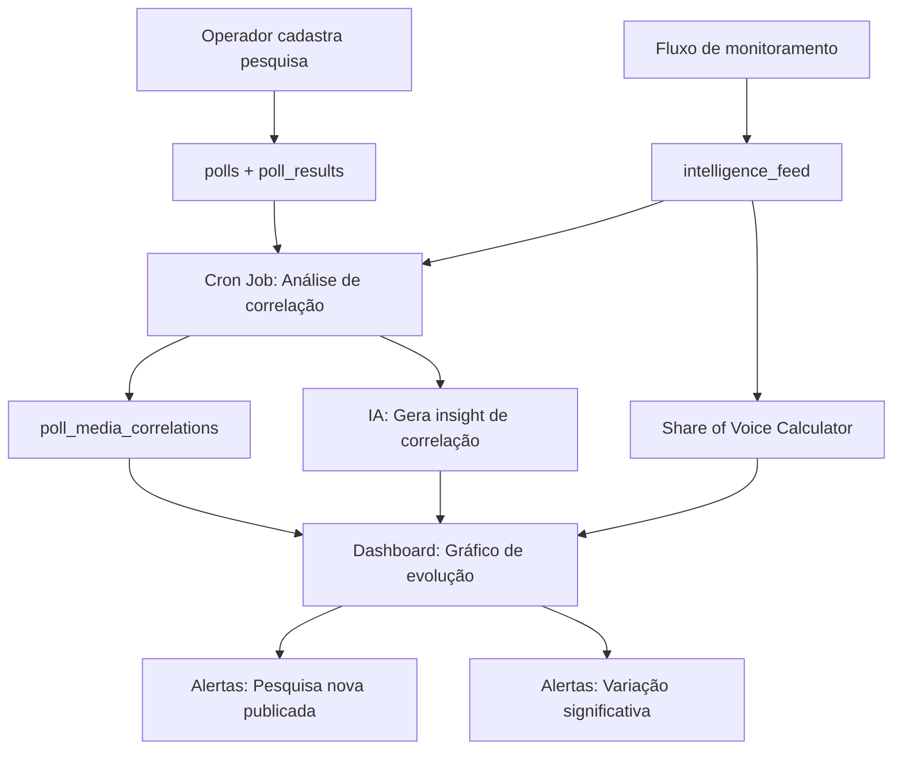

# 📊 Módulo: Analista de Pesquisas Eleitorais

> Esquemático completo para implementação futura.
> Última atualização: 2026-02-22

---

## 1. Visão Geral

Sistema de ingestão, análise e cruzamento de pesquisas eleitorais com os dados de monitoramento de mídia já existentes no War Room. O objetivo é transformar dados brutos de pesquisas em **inteligência preditiva** — correlacionando movimentos nas pesquisas com eventos midiáticos.

### Casos de Uso

| Persona | Cenário |
|---------|---------|
| **Coordenador de Campanha** | "Caímos 3pp no Nordeste. O que aconteceu na mídia nos últimos 7 dias nessa região?" |
| **Analista de Dados** | "Quero ver a evolução de todos os candidatos nas pesquisas e sobrepor com o sentimento da mídia" |
| **Assessor de Comunicação** | "Após o debate, subimos nas pesquisas? O sentimento melhorou?" |
| **Estrategista** | "Qual instituto está mostrando tendência mais favorável? Há discrepância entre institutos?" |

---

## 2. Database Schema

### Tabela `polls` — Pesquisas registradas no TSE

```sql
CREATE TABLE polls (
    id UUID PRIMARY KEY DEFAULT gen_random_uuid(),
    
    -- Identificação
    institute TEXT NOT NULL,              -- 'Datafolha', 'Ipec', 'Atlas Intel', 'Quaest', etc.
    registration_tse TEXT,                -- Registro no TSE (ex: BR-00123/2026)
    methodology TEXT,                     -- 'presencial', 'telefonica', 'online', 'mista'
    
    -- Período
    fieldwork_start DATE NOT NULL,        -- Início da coleta
    fieldwork_end DATE NOT NULL,          -- Fim da coleta
    published_at TIMESTAMPTZ NOT NULL,    -- Data de publicação
    
    -- Amostra
    sample_size INTEGER NOT NULL,         -- Tamanho da amostra
    margin_of_error NUMERIC(4,2),         -- Margem de erro (ex: 2.00 = ±2%)
    confidence_level NUMERIC(5,2) DEFAULT 95.00, -- Nível de confiança (%)
    
    -- Escopo
    election_type TEXT NOT NULL,          -- 'presidencial', 'governador', 'senador', 'dep_federal', 'dep_estadual', 'prefeito'
    election_year INTEGER NOT NULL,       -- 2026, 2028, etc.
    scope_region TEXT DEFAULT 'BR',       -- 'BR' (nacional), 'SP', 'RJ', 'NE' (Nordeste), etc.
    round TEXT DEFAULT '1',               -- '1' ou '2' (turno)
    scenario TEXT DEFAULT 'estimulada',   -- 'estimulada', 'espontanea'
    
    -- Metadata
    source_url TEXT,                      -- URL da matéria/publicação original
    notes TEXT,                           -- Observações do operador
    
    -- Controle
    created_by UUID REFERENCES auth.users(id),
    created_at TIMESTAMPTZ DEFAULT now(),
    updated_at TIMESTAMPTZ DEFAULT now(),
    user_id UUID REFERENCES auth.users(id), -- RLS
    
    -- Índices
    CONSTRAINT valid_election_type CHECK (
        election_type IN ('presidencial', 'governador', 'senador', 'dep_federal', 'dep_estadual', 'prefeito')
    )
);

CREATE INDEX idx_polls_election ON polls(election_type, election_year);
CREATE INDEX idx_polls_published ON polls(published_at DESC);
CREATE INDEX idx_polls_institute ON polls(institute);
```

### Tabela `poll_results` — Resultados por candidato

```sql
CREATE TABLE poll_results (
    id UUID PRIMARY KEY DEFAULT gen_random_uuid(),
    poll_id UUID NOT NULL REFERENCES polls(id) ON DELETE CASCADE,
    
    -- Candidato
    candidate_name TEXT NOT NULL,         -- Nome do candidato
    candidate_party TEXT,                 -- Partido (PT, PL, MDB, etc.)
    candidate_number INTEGER,             -- Número de urna
    candidate_photo_url TEXT,             -- URL da foto
    
    -- Resultado
    percentage NUMERIC(5,2) NOT NULL,     -- % de intenção de voto
    percentage_valid NUMERIC(5,2),        -- % de votos válidos (sem branco/nulo)
    
    -- Categorias especiais
    is_blank_null BOOLEAN DEFAULT FALSE,  -- É "branco/nulo/nenhum"?
    is_undecided BOOLEAN DEFAULT FALSE,   -- É "não sabe/indeciso"?
    is_abstention BOOLEAN DEFAULT FALSE,  -- É "não vai votar"?
    
    -- Evolução
    previous_percentage NUMERIC(5,2),     -- % na pesquisa anterior do mesmo instituto
    variation NUMERIC(5,2),               -- Variação em pp (atual - anterior)
    
    -- Controle
    created_at TIMESTAMPTZ DEFAULT now()
);

CREATE INDEX idx_poll_results_poll ON poll_results(poll_id);
CREATE INDEX idx_poll_results_candidate ON poll_results(candidate_name);
```

### Tabela `candidates` — Cadastro de candidatos (normalização)

```sql
CREATE TABLE candidates (
    id UUID PRIMARY KEY DEFAULT gen_random_uuid(),
    
    name TEXT NOT NULL,                   -- Nome completo
    display_name TEXT NOT NULL,           -- Nome exibido (ex: "Lula", "Bolsonaro")
    party TEXT,                           -- Partido atual
    election_type TEXT NOT NULL,          -- 'presidencial', 'senador', etc.
    state TEXT,                           -- UF (para cargos estaduais)
    photo_url TEXT,
    color TEXT,                           -- Cor no gráfico (hex)
    
    -- Keywords para cruzar com intelligence_feed
    monitoring_keywords TEXT[],           -- ["lula", "luiz inácio", "PT presidente"]
    
    -- Status
    is_active BOOLEAN DEFAULT TRUE,
    created_at TIMESTAMPTZ DEFAULT now(),
    user_id UUID REFERENCES auth.users(id)
);

CREATE INDEX idx_candidates_election ON candidates(election_type);
```

### Tabela `poll_media_correlations` — Análises de correlação (gerado pela IA)

```sql
CREATE TABLE poll_media_correlations (
    id UUID PRIMARY KEY DEFAULT gen_random_uuid(),
    
    poll_id UUID REFERENCES polls(id),
    candidate_name TEXT NOT NULL,
    
    -- Período de análise (7 dias antes da pesquisa)
    analysis_start DATE NOT NULL,
    analysis_end DATE NOT NULL,
    
    -- Métricas de mídia no período
    total_mentions INTEGER DEFAULT 0,
    positive_mentions INTEGER DEFAULT 0,
    negative_mentions INTEGER DEFAULT 0,
    neutral_mentions INTEGER DEFAULT 0,
    avg_risk_score NUMERIC(5,2),
    sentiment_net INTEGER,                -- positivos - negativos
    share_of_voice NUMERIC(5,2),          -- % de menções vs total
    
    -- Correlação
    poll_variation NUMERIC(5,2),          -- Variação na pesquisa (pp)
    correlation_score NUMERIC(5,2),       -- Score de correlação (-1 a 1)
    
    -- Insight gerado pela IA
    ai_analysis TEXT,                     -- "O candidato X caiu 3pp após menções negativas sobre..."
    
    created_at TIMESTAMPTZ DEFAULT now()
);
```

---

## 3. RLS (Row Level Security)

```sql
-- Mesma lógica de RLS do restante do sistema
ALTER TABLE polls ENABLE ROW LEVEL SECURITY;
ALTER TABLE poll_results ENABLE ROW LEVEL SECURITY;
ALTER TABLE candidates ENABLE ROW LEVEL SECURITY;

CREATE POLICY "polls_user_access" ON polls
    FOR ALL USING (auth.uid() = user_id);

CREATE POLICY "poll_results_via_poll" ON poll_results
    FOR ALL USING (
        poll_id IN (SELECT id FROM polls WHERE user_id = auth.uid())
    );

CREATE POLICY "candidates_user_access" ON candidates
    FOR ALL USING (auth.uid() = user_id);
```

---

## 4. API Endpoints

### Backend (Express)

```
POST   /api/polls                    → Criar pesquisa + resultados
GET    /api/polls                    → Listar pesquisas (filtros: election_type, institute, date range)
GET    /api/polls/:id                → Detalhe de uma pesquisa
PUT    /api/polls/:id                → Editar pesquisa
DELETE /api/polls/:id                → Remover pesquisa

GET    /api/polls/evolution           → Evolução temporal por candidato
GET    /api/polls/comparison          → Comparativo entre institutos
GET    /api/polls/correlation/:candidate → Correlação mídia × pesquisa

POST   /api/candidates               → Cadastrar candidato
GET    /api/candidates                → Listar candidatos
PUT    /api/candidates/:id            → Editar candidato

POST   /api/polls/import/csv          → Importar pesquisa via CSV
```

### RPC Functions (Supabase)

```sql
-- Evolução de um candidato ao longo do tempo
CREATE OR REPLACE FUNCTION get_poll_evolution(
    p_candidate TEXT,
    p_election_type TEXT DEFAULT 'presidencial',
    p_months INTEGER DEFAULT 6
) RETURNS TABLE (
    published_at DATE,
    institute TEXT,
    percentage NUMERIC,
    margin_of_error NUMERIC,
    variation NUMERIC
) AS $$
    SELECT 
        p.published_at::DATE,
        p.institute,
        pr.percentage,
        p.margin_of_error,
        pr.variation
    FROM poll_results pr
    JOIN polls p ON p.id = pr.poll_id
    WHERE pr.candidate_name ILIKE '%' || p_candidate || '%'
      AND p.election_type = p_election_type
      AND p.published_at >= now() - (p_months || ' months')::INTERVAL
    ORDER BY p.published_at ASC;
$$ LANGUAGE SQL STABLE;

-- Share of Voice: menções por candidato no intelligence_feed
CREATE OR REPLACE FUNCTION get_share_of_voice(
    p_candidate_keywords TEXT[],
    p_days INTEGER DEFAULT 7
) RETURNS TABLE (
    candidate TEXT,
    mentions BIGINT,
    positive BIGINT,
    negative BIGINT,
    share_pct NUMERIC
) AS $$
    -- Lógica: contar menções no intelligence_feed onde keywords
    -- intersectam com p_candidate_keywords
$$ LANGUAGE SQL STABLE;
```

---

## 5. Componentes Frontend

### Páginas

```
/polls                  → Lista de pesquisas (tabela + filtros)
/polls/new              → Formulário de cadastro de pesquisa
/polls/:id              → Detalhe da pesquisa (gráfico de pizza + tabela)
/polls/evolution        → Gráfico de evolução (line chart multi-candidato)
/polls/comparison       → Comparativo entre institutos
/candidates             → Cadastro de candidatos monitorados
```

### Componentes

```
PollsPage.tsx              → Página principal com tabela de pesquisas
PollForm.tsx               → Formulário de cadastro/edição
PollEvolutionChart.tsx     → Gráfico de linha (Recharts) com evolução temporal
PollComparisonChart.tsx    → Gráfico comparativo entre institutos  
PollMediaOverlay.tsx       → Overlay de sentimento de mídia sobre gráfico de pesquisa
CandidateManager.tsx       → CRUD de candidatos monitorados
PollDashboardWidget.tsx    → Widget resumo para o Dashboard principal
ShareOfVoiceChart.tsx      → Gráfico de barras SOV
```

### Dashboard Widget (Mini)

Widget compacto para o dashboard principal mostrando:
- Última pesquisa publicada
- Top 3 candidatos com variação
- Gráfico sparkline dos últimos 30 dias

---

## 6. Fluxo de Dados



---

## 7. Integrações Futuras

### a) Scraping Automático de Pesquisas

Monitores automáticos para capturar pesquisas publicadas:

| Fonte | Método | Frequência |
|-------|--------|-----------|
| TSE (DivulgaCandContas) | API pública | Diário |
| Poder360 (Agregador) | Scraping | 2x ao dia |
| G1/Folha/Estadão | RSS + Parser | Contínuo |

### b) Agregador de Pesquisas (Média Ponderada)

Inspirado no RealClearPolitics/FiveThirtyEight:

```
Média Ponderada = Σ (peso_instituto × percentual) / Σ pesos

Peso por critério:
  - Tamanho da amostra: 1-3 pontos
  - Metodologia presencial: +2 pontos
  - Recência (últimos 7 dias): +3 pontos
  - Margem de erro < 2%: +1 ponto
  - Instituto com track record: +2 pontos
```

### c) Modelo Preditivo (Fase Futura)

```
Inputs:
  - Série temporal de pesquisas (6 meses)
  - Sentimento de mídia (30 dias)
  - Share of Voice
  - Eventos marcantes (debates, escândalos)

Output:
  - Projeção de intenção de voto (IC 95%)
  - Probabilidade de ir para 2º turno
  - Cenários: otimista / base / pessimista
```

---

## 8. Tipos de Gráficos

### a) Evolução Temporal (Line Chart)
- Eixo X: tempo (meses/semanas)
- Eixo Y: % de intenção de voto
- Linhas: uma por candidato (cor do partido)
- Indicadores: margem de erro como área sombreada
- Overlay: eventos marcantes (debate, escândalo) como markers verticais

### b) Comparativo de Institutos (Grouped Bar)
- Agrupado por candidato
- Barras: uma por instituto
- Mostra discrepância entre institutos

### c) Share of Voice (Donut/Pie)
- % de menções por candidato
- Centro: total de menções
- Hover: breakdown sentimento

### d) Correlação Mídia × Pesquisa (Dual Axis)
- Eixo Y esquerdo: % pesquisa (linha)
- Eixo Y direito: sentimento net (barras)
- Eixo X: tempo
- Mostra visualmente a correlação

### e) Mapa de Calor Regional (Choropleth)
- Mapa do Brasil por UF
- Cor: intensidade do candidato naquela região
- Filtros: candidato, instituto, período

---

## 9. Alertas Específicos

| Alerta | Trigger | Urgência |
|--------|---------|----------|
| Nova pesquisa publicada | `INSERT` em `polls` | 🟡 Normal |
| Variação ≥ 3pp | `variation >= 3 OR variation <= -3` | 🟠 Alta |
| Candidato ultrapassa outro | Rank muda entre pesquisas consecutivas | 🔴 Crítica |
| Empate técnico | Diferença entre top 2 < margem de erro | 🟠 Alta |
| Instituto inédito | Novo instituto publica pela 1ª vez | 🟡 Normal |
| Discrepância entre institutos | Diferença > 5pp para mesmo candidato | 🟡 Normal |

---

## 10. Importação de Dados

### CSV Format

```csv
instituto,registro_tse,metodologia,inicio_campo,fim_campo,publicacao,amostra,margem_erro,tipo_eleicao,ano,regiao,cenario,candidato,partido,percentual,votos_validos,branco_nulo,indeciso
Datafolha,BR-00123/2026,presencial,2026-03-01,2026-03-03,2026-03-05,2000,2.0,presidencial,2026,BR,estimulada,Candidato A,PT,32.5,38.1,false,false
Datafolha,BR-00123/2026,presencial,2026-03-01,2026-03-03,2026-03-05,2000,2.0,presidencial,2026,BR,estimulada,Candidato B,PL,28.0,32.8,false,false
Datafolha,BR-00123/2026,presencial,2026-03-01,2026-03-03,2026-03-05,2000,2.0,presidencial,2026,BR,estimulada,Branco/Nulo,-,8.0,,true,false
Datafolha,BR-00123/2026,presencial,2026-03-01,2026-03-03,2026-03-05,2000,2.0,presidencial,2026,BR,estimulada,Não sabe,-,12.0,,false,true
```

### Upload via UI
- Drag & drop ou file select
- Preview da tabela antes de confirmar
- Validação: totais devem somar ~100% (±2%)
- Detecção automática de candidato existente

---

## 11. Estimativa de Esforço

| Fase | Itens | Estimativa |
|------|-------|-----------|
| **1. Schema + Backend** | Tabelas, RLS, CRUD API, CSV import | 2-3 dias |
| **2. UI Básica** | Lista, formulário, tabela de resultados | 2 dias |
| **3. Gráficos** | Evolução, comparativo, SOV (Recharts) | 3 dias |
| **4. Correlação** | Cruzamento mídia × pesquisa, insights IA | 3-4 dias |
| **5. Dashboard Widget** | Mini widget, alertas, sparklines | 1 dia |
| **6. Scraping automático** | Parser de pesquisas publicadas | 3-5 dias (futuro) |
| **7. Modelo preditivo** | ML/Statistical forecasting | 5-10 dias (futuro) |
| **Total MVP (fases 1-5)** | | **~11-13 dias** |

---

## 12. Dependências Técnicas

| Dependência | Uso | Já instalada? |
|-------------|-----|---------------|
| `recharts` | Gráficos de evolução, barras, pizza | ✅ Sim |
| `date-fns` | Formatação de datas | ✅ Sim |
| `xlsx` | Import/Export de CSV/Excel | ✅ Sim |
| `@supabase/supabase-js` | Acesso ao banco | ✅ Sim |
| Gemini API | Geração de insights de correlação | ✅ Sim |

> **Nenhuma dependência nova necessária para o MVP.**
